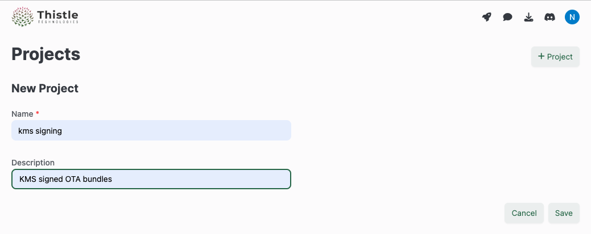
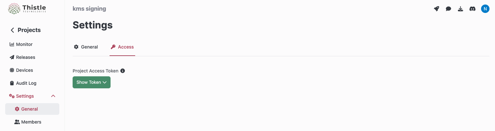

# trh-k: Thistle Release Helper with KMS Signing

[](https://github.com/thistletech/trh-k/actions/workflows/shellcheck.yml)
[](https://github.com/thistletech/trh-k/actions/workflows/markdownlint.yml)

This repository contains the tools and instructions for releasing a Thistle OTA
update bundle signed with a key managed in a Cloud KMS (key management system).
Currently, [GCP KMS](https://cloud.google.com/security-key-management) is
supported.

## System Requirements

You need

- MacOS (`x86_64` or `aarch64`) or Linux (`x86_64`, tested on Ubuntu)
- A [Google Cloud
  project](https://cloud.google.com/resource-manager/docs/creating-managing-projects)
  with [Cloud Key Management Service (KMS)
  API](https://cloud.google.com/kms/docs/reference/rest) enabled, and a
  principal (user account) with the following IAM roles assigned

  - roles/cloudkms.signerVerifier
    - This role is a role needed for `sign`, and for querying an existing public
      key in KMS with `keygen`
    - It can be assigned to a principal responsible for signing an OTA bundle
  - roles/cloudkms.admin
    - This is a role only needed for `keygen` for the first-time key generation.
      It alone does not allow for signing of an OTA bundle
    - It can be assigned to a principal responsible for administration of Cloud
      KMS operations in your Cloud account

## Create a KMS Key Pair for Signing (One-Time Setup)

This step only needs to be done once per release signing key.

- First, clone this repository, and activate Hermit

  ```bash
  $ git clone https://github.com/thistletech/trh-k.git
  $ . trh-k/bin/activate-hermit
  trh-k🐚 $
  ```

- Create a JSON configuration file, say, `gcp_config.json` (cf.
  [sample_gcp_config.json](./sample_gcp_config.json)), containing the following
  fields that describe the to-be-generated signing key.

  ```json
  {
    "project": "GCP project name, e.g., my-awsome-gcp-project",
    "location": "GCP region, e.g., us-west1",
    "keyring": "Name of keyring, e.g., dummy-keyring-for-trh-k",
    "keyname": "Name of signing key, e.g., dummy-key-for-trh-k"
  }
  ```

- Generate a new ECDSA key pair in KMS for OTA bundle signing, as described in
  `gcp_config.json`. All commands below are executed under an active Hermit
  environment.

  ```bash
  # Login to GCP project
  $ gcloud auth login
  $ gcloud config set project YOUR_PROJECT_ID
  # Keygen
  $ trh-k/thistle-bin/keygen-gcp-k -c gcp_config.json
  # Example output
  Please add the following public key to the public_keys array in TRH configuration:
  ecdsa:BK9k+finvyLNVoqj5p07EvMh9OiOQ2DIK7w4uii1UVNc7yWB4lCI/Wk3I/PRHthBbPKSog3dis5ALzMdsHqSIC4=
  ```

  Save the public key value for the initialization step later, or one can run
  `keygen-gcp-k` again to print the public key value to the console.

## Create Device Project and Obtain Access Token (One-Time Setup)

1. Login to the [Thistle portal](https://app.thistle.tech/projects/), and create
   a new project where your fleet of devices associated with the OTA bundle are
   managed. In the example below, we name the project "kms signing".

   

2. In the newly created project "kms signing", in the upper right corner, click
   the button "Access Token" to obtain the API token to be used as
   `THISTLE_TOKEN` in the initialization step.

   

## Initialization (One-Time Setup)

In the project initialization step, we generate a release manifest file
(`manifest.json`) and a device configuration file (`config.json`) using the
Thistle Release Helper (`trh`).

- The manifest file will be used by a release operator, with the help of `trh`,
  to describe an OTA bundle for devices in the project.

- The device configuration file will be provisioned into a device where the
  Thistle Update Client (`tuc`) runs, and can be used as a boilerplate template
  for subsequent devices added to the project.

On a Linux or macOS machine, initialize the project as follows.

```bash
# Create an empty "release" directory for the tutorial, and change to it
$ mkdir release
$ cd release
# Clone this repo
$ git clone https://github.com/thistletech/trh-k.git
# Activate Hermit, and run subsequent commands in Hermit environment
$ . trh-k/bin/activate-hermit
# Paste the "Access Token" of the project obtained from Thistle portal, and type
# enter + ctrl-d
trh-k🐚 $ export THISTLE_TOKEN=$(cat)
trh-k🐚 $ trh init --persist /path/to/device-persist-storage \
  --public-key <PUBLIC_KEY>
# Example:
# trh init --persist /tmp/persist \
#  --public-key "ecdsa:BK9k+finvyLNVoqj5p07EvMh9OiOQ2DIK7w4uii1UVNc7yWB4lCI/Wk3I/PRHthBbPKSog3dis5ALzMdsHqSIC4="
...
Manifest generated at: "./manifest.json"
Configuration generated at path "./config.json"
```

Here, `<PUBLIC_KEY>` is the public key value shown in the YubiKey provisioning
step.

- An example of `config.json` created in this step.

  ```json
  {
    "name": "mydevice",
    "persistent_directory": "/tmp/persist",
    "device_enrollment_token": "redacted_device_token",
    "public_keys": ["ecdsa:BK9k+finvyLNVoqj5p07EvMh9OiOQ2DIK7w4uii1UVNc7yWB4lCI/Wk3I/PRHthBbPKSog3dis5ALzMdsHqSIC4="]
  }
  ```

  This configuration file can be used as a template for other devices in the
  same project. While `persistent_directory`, `device_enrollment_token` and
  `public_keys` values are shared by all devices in the project, the fields
  `name` and`device_id` can be device unique, and customizable according to a
  customer's device management setting.

  Note that [Thistle Update Client
  (TUC)](https://docs.thistle.tech/update_client/overview) and Thistle's backend
  by default assume a "self-provisioning (aka self-enrollment)" model: Suppose
  `device_id` is missing from `config.json`, and `device_enrollment_token` is
  valid.  During the first HTTP request from TUC to the backend `device_id` is
  not present. In this case, this request will be viewed as a "device
  provisioning" request (authorized by `device_enrollment_token`): a new, unique
  `device_id` will be automatically created on the backend, and returned to the
  client to persist.  Subsequent client-initiated requests will have this
  `device_id` value included for device identification.

  Thistle's OTA update system can also be customized to support a device key
  provisioning mechanism with pre-generated, pre-configured `device_name` and
  `device_id`, if it's better suited for a customer's device manufacturing
  needs.

- An example of `manifest.json` created in this step.

  ```json
  {
    "comment": null,
    "id": "01GKMZAJ5X229EHVR1WK4T43FX",
    "ts": "1670372477.117195000",
    "version": 1,
    "name": "default",
    "signature": "",
    "pre_install": null,
    "post_install": null,
    "post_reboot": null,
    "rootfs": null,
    "files": [],
    "status": null,
    "path": null
  }
  ```

## Prepare, Sign and Release OTA Bundle

As with [File Update](https://docs.thistle.tech/getting_started/file) and [Full
System Update](https://docs.thistle.tech/getting_started/rpi), we use `trh`'s
subcommands `prepare` and `release` to prepare, sign and release OTA bundles,
but also supply the `--external-sign` argument for KMS signing.

Let's use the following file update case as an example.

In the `release` directory on a Linux or macOS machine, run the follow commands.
Make sure `manifest.json` and `gcp_config.json` are directly under `release/`.

```bash
# Activate Hermit, and run subsequent commands in Hermit environment
$ . trh-k/bin/activate-hermit
# Paste the "Access Token" of the project obtained from Thistle portal, and type
# enter + ctrl-d
trh-k🐚 $ export THISTLE_TOKEN=$(cat)
# Prepare a local OTA bundle
trh-k🐚 $ mkdir -p rel/tmp
trh-k🐚 $ echo "This is a test" > rel/tmp/test.txt
trh-k🐚 $ trh --external-sign "trh-k/thistle-bin/sign-gcp-k -c gcp_config.json" prepare -t=./rel
Read manifest at "./manifest.json"
Processed file "./rel/tmp/test.txt"
Executing external signing command
=====
=====
Manifest amended successfully
# Release OTA bundle to Thistle backend
trh-k🐚 $ trh --external-sign "trh-k/thistle-bin/sign-gcp-k -c gcp_config.json" release
Read manifest at "./manifest.json"
Uploaded asset test.txt
Executing external signing command
=====
=====
Manifest uploaded successfully
```

To update an existing release, re-run `trh prepare` and `trh release` commands
with the `--external-sign` argument exactly as above, and as described
[here](https://docs.thistle.tech/getting_started/file#update-an-existing-release),
to get the manifest updated and signed, and OTA bundle uploaded to Thistle
backend.

## Test Release Update

On a device running `tuc`, run the following command to test the released OTA
bundle, using `config.json`. This is similar to what is described
[here](https://docs.thistle.tech/getting_started/file#upload-and-test-deployed-release).

```bash
trh-k🐚 $ tuc --log-level=info -c config.json
```

## Synopsis of trh-k Commands

- thistle-bin/keygen-gcp-k

  ```text
  Usage:
    thistle-bin/keygen-gcp-k -c CONFIG_FILE
      If GCP KMS resources in CONFIG_FILE are already provisioned, prints out public key string.
      Otherwise, generates a new key pair in GCP KMS as specified in CONFIG_FILE.
      User needs to login to appropriate GCP account and project before invoking command.
  ```

- thistle-bin/sign-gcp-k

  ```text
  Usage:
    thistle-bin/sign-gcp-k -c CONFIG_FILE SIGNABLE_STRING
      Signs SIGNABLE_STRING using GCP resources specified in CONFIG_FILE
  ```
